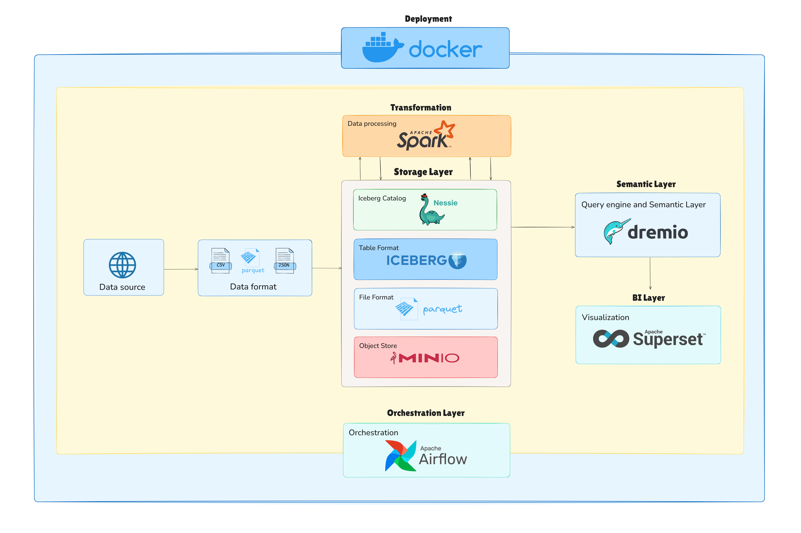

# Vietnam Labor Market Data Lakehouse Project

    

## Project Overview

This repository contains a complete implementation of a modern **Data Lakehouse system** built with open-source technologies. The main objective is:

> **Design and implement a scalable Data Lakehouse to collect, store, process, and analyze Vietnam's labor market and employment data.**

The project goes beyond basic data infrastructure by incorporating advanced techniques such as:
- Skill extraction from job postings using Named Entity Recognition (NER) with fine-tuned XLM-RoBERTa
- Multivariate time series forecasting (VAR and VARNN models) for key macroeconomic indicators
- Comprehensive data visualization through interactive dashboards

## System Architecture


## Data Sources
```
├── Job portals (TopCV, VietnamWorks, CareerViet, etc.)
└── Macroeconomic data (ILO, VBMA, General Statistics Office, etc.)
```

Data is organized following the **Medallion Architecture**:
- **Bronze**: Raw data
- **Silver**: Cleaned, standardized, and enriched data (including extracted skills via NER)
- **Gold**: Aggregated data modeled with star/snowflake schemas for analytics and BI

## Key Technologies

| Component                | Technology Used                  | Role                                          |
|--------------------------|----------------------------------|-----------------------------------------------|
| Storage                  | MinIO                            | S3-compatible object storage                  |
| Table Format             | Apache Iceberg                   | ACID transactions, schema evolution, time travel |
| Catalog & Versioning     | Project Nessie                   | Git-like metadata versioning                  |
| Data Processing          | Apache Spark                     | ETL, batch/stream processing                  |
| Query Engine & Semantic Layer | Dremio                      | High-performance SQL, reflections, virtual datasets |
| Visualization            | Apache Superset                  | Interactive BI dashboards                     |
| Orchestration            | Apache Airflow                   | Pipeline scheduling and orchestration         |
| Containerization         | Docker + Docker Compose          | Consistent environment deployment             |
| NER Model                | Fine-tuned XLM-RoBERTa           | Skill extraction from job descriptions        |
| Time Series Forecasting  | VAR & custom VARNN (Keras)       | Forecasting CPI, GDP, Inflation               |

## Key Dashboards & Analyses

1. **Labor Market Overview Dashboard**
   - Total job postings, average salary, required experience
   - Trends over time

2. **Industry & Location Analysis Dashboard**
   - Top-paying industries, most active recruiters
   - Geographic distribution of jobs

3. **Skill Demand Dashboard**
   - Most in-demand skills
   - Skill coverage by industry

4. **Macro Economy & Labor Dashboard**
   - Correlations between GDP, unemployment, CPI, inflation
   - Unemployment breakdown by age and gender

5. **VAR vs VARNN Forecasting Dashboard**
   - Comparison of actual vs. forecasted values for CPI, GDP, Inflation
   - Performance metrics (MSE, RMSE, MAE)

## How to Run Locally

### Requirements
- Docker & Docker Compose
- Machine with at least 16GB RAM (32GB recommended for full stack)

### Steps

1. Clone the repository
```bash
git clone https://github.com/daley12306/careerlake-vn.git
cd careerlake-vn
```

2. Start the full stack
```bash
docker-compose up -d
```

3. Wait for services to initialize (5–10 minutes on first run)

4. Access the interfaces:
- Apache Superset: http://localhost:8088 (admin / admin)
- Dremio: http://localhost:9047
- MinIO: http://localhost:9001 (access: admin, secret: password)
- Airflow: http://localhost:8080 (airflow / password)

5. Trigger DAGs in Airflow to run ingestion → processing → loading pipelines

## Project Structure
```
.
├── airflow/                    # Airflow DAGs, configs, logs
├── data/                       # Raw & processed data
├── dremio/                     # Dremio configuration & metadata
├── minio-data/                 # MinIO object storage data
├── models/                     # ML / analytics models
├── nessie-data/                # Project Nessie metadata
├── notebooks/                  # Jupyter notebooks (EDA, experiments)
├── postgres-airflow-data/      # PostgreSQL data for Airflow
├── postgres-nessie-data/       # PostgreSQL data for Nessie
├── postgres-superset-data/     # PostgreSQL data for Superset
├── scripts/                    # Utility & setup scripts
├── spark/                      # Apache Spark jobs & configs
├── superset/                   # Apache Superset configuration
│
├── .gitignore                  # Git ignore rules
├── architecture.png            # System architecture diagram
├── docker-compose.yml          # Docker Compose orchestration
└── README.md                   # Project documentation

```

## Future Improvements
- Real-time data ingestion from additional sources
- Detailed skill categorization (hard/soft skills, certifications)
- Public API and interactive dashboards
- Integration with LLMs for natural language queries about the labor market
Contributions, issues, and pull requests are welcome!

## Authors
Quách Nguyễn Duy Thiện - Student ID 22133055

Nguyễn Thanh Thiên Phúc - Student ID 22133042

Advisor: MSc. Trần Trọng Bình

Faculty of Information Technology - Ho Chi Minh City University of Technical Education

Year: 2025

## License
This project is licensed under the MIT License - feel free to use, modify, and redistribute.

---

Thank you for your interest in the project!

If you find it useful, please give the repository a ⭐! 🚀
